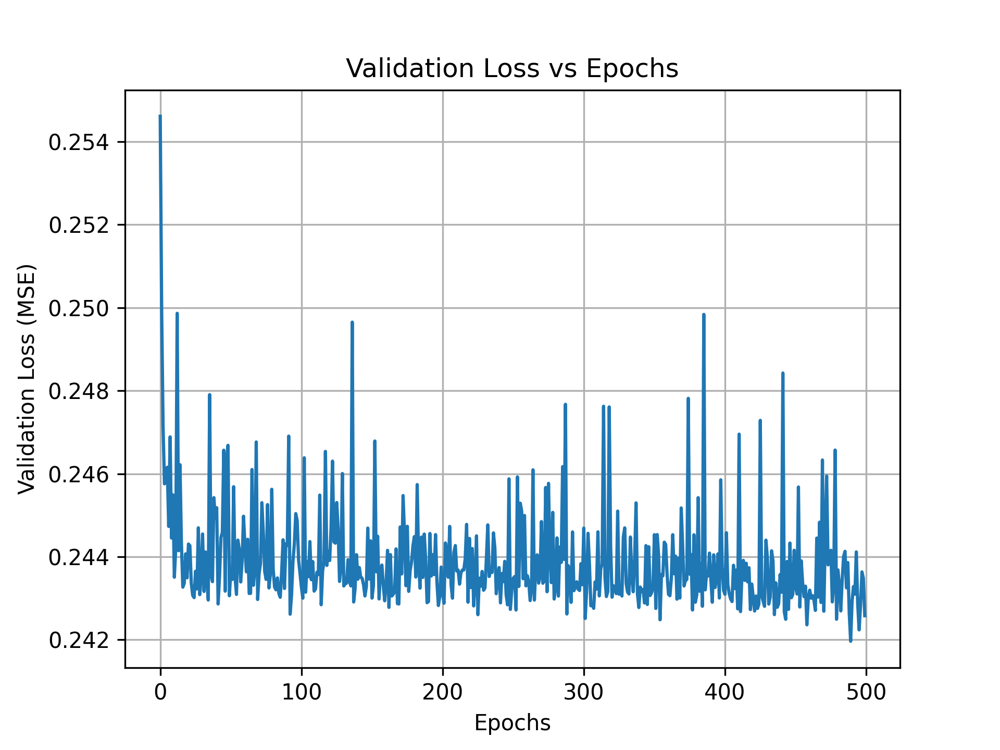

# 📈 FunctionApproximation-NN

This project implements a feedforward neural network to approximate a complex nonlinear mathematical function using regression.  
The network is trained on synthetic data generated from the target expression, using Keras and TensorFlow.

---

## 📐 Target Function

The function to approximate is:

y = sin(2πx₁) * x₂ * x₃ * x₄ * exp(−(x₁ + x₂ + x₃ + x₄))

Where:
- Inputs: `x₁, x₂, x₃, x₄ ∈ [-1, 1]`
- Output: scalar value `y`

---

## 🧠 Neural Network Architecture

- **Input layer**: 4 features  
- **Hidden layer**: 50 neurons  
  - Activation: `sigmoid`  
- **Output layer**: 1 neuron  
  - Activation: `linear`  
- **Loss function**: Mean Squared Error (MSE)  
- **Optimizer**: Adam  
- **Epochs**: 500  

---

## 📂 Data

- **Generated 1000 samples** for each input in range [-1, 1]
- Final dataset: 1000 (x, y) pairs  
- Data split:
  - Training: **70%**
  - Validation: **15%**
  - Testing: **15%**

---

## 📈 Training Loss Curve

<p align="center">
  
  <br>
  <em>Figure: Validation Loss vs. Epochs</em>
</p>

This plot helps visualize model performance and identify the best training epoch.

---

## 🎯 Evaluation

The model was evaluated on the **test set**, and its performance was measured using the **Root Mean Square Error (RMSE)**:

### ✅ Final RMSE: **0.4029**

---

## ▶️ How to Run

You can run the script directly:

```bash
python fun_approx.py