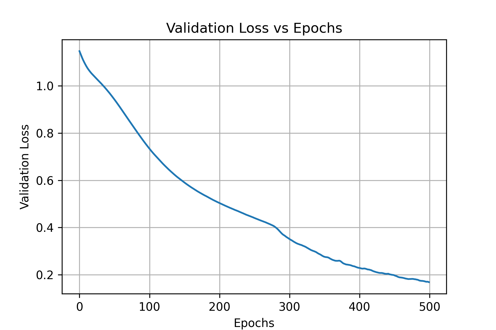
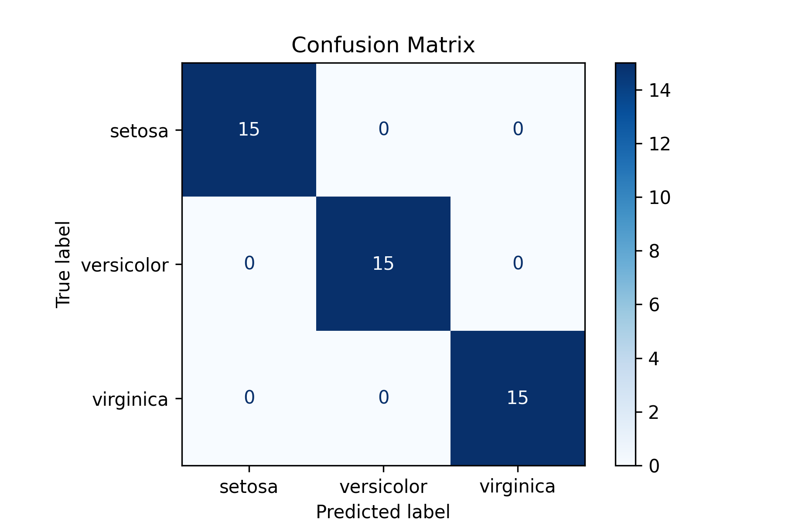

# 🌸 IrisClassification-NN

This project implements a neural network classifier for the well-known [Iris flower dataset](https://en.wikipedia.org/wiki/Iris_flower_data_set) using Keras and TensorFlow.  
The neural network follows a **4-10-3 architecture**, where the input layer receives 4 features, a hidden layer with 10 sigmoid-activated neurons, and an output layer with 3 softmax neurons for classification.

---

## 📊 Problem Overview

The Iris dataset contains **150 samples**, each with 4 features:
- Sepal length
- Sepal width
- Petal length
- Petal width

The goal is to classify each sample into one of **three flower species**:
- Iris Setosa (Class 1)
- Iris Versicolor (Class 2)
- Iris Virginica (Class 3)

---

## 🧠 Model Architecture

- **Input layer**: 4 neurons (for the 4 features)  
- **Hidden layer**: 10 neurons, activation = `sigmoid`  
- **Output layer**: 3 neurons, activation = `softmax`  
- **Loss function**: Categorical Crossentropy  
- **Optimizer**: Adam  
- **Training epochs**: 500

---

## 📂 Data Splitting

The dataset is split as follows:
- **Training**: 50%
- **Validation**: 20%
- **Testing**: 30%

Stratified splitting was used to maintain class balance across all sets.

---

## 📈 Training Performance

Below is the validation loss curve during training, which helps in identifying the epoch where the model performs best on unseen data:

<p align="center">
  
  <br>
  <em>Figure: Validation Loss vs Epochs</em>
</p>

---

## 📌 Evaluation

After training, predictions were made on the **test set**, and performance was evaluated using a **confusion matrix**:

<p align="center">
  
  <br>
  <em>Figure: Confusion Matrix on Test Set <b>100%</b></em>
</p>

This matrix highlights how well the classifier distinguished between the three Iris classes.

---

## ▶️ How to Run

Run the script directly:
```bash
python iris.py